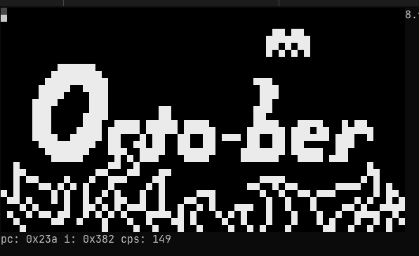

# Fish8
This is a [CHIP-8](https://en.wikipedia.org/wiki/CHIP-8) emulator written in [Fish Shell](https://fishshell.com/). For the lulz.

This is very incomplete. It can run some simple ROMs, but there's no support for keyboard input. I couldn't figure out how to poll the keyboard in a non-blocking way from fish.



## Usage & Stuff
```
# run a rom
$ ./fish8.fish roms/octojam1title.ch8

# run tests
$ make test
```
## Notes on the Fish Shell Language
This was mostly an exercise to learn about fish. I took some notes about quirks I encountered.

I like fish for interactive use. For scripting, the nicest thing I will say about it: it's not as bad as bash.

#### Exit on error
There's no way to tell fish to exit on errors (like [set -e](https://www.gnu.org/software/bash/manual/html_node/The-Set-Builtin.html#index-set)] in bash). When stuff is broken, it just keeps marching on, possibly spewing error messages as it goes.

There's a [discussion about this in the bug tracker](https://github.com/fish-shell/fish-shell/issues/510).

#### Reading a Binary File
I couldn't figure out a good way to read in a binary file. The [read command](https://fishshell.com/docs/current/cmds/read.html) seemed to choke on the NULL bytes as did `set myvar (cat file.bin)`

I ended up doing something really hacky with [od](https://en.wikipedia.org/wiki/Od_(Unix) and [sed](https://en.wikipedia.org/wiki/Sed).

#### Arrays are indexed starting at 1
This is painful, at least when writing a program like Fish8. According to the docs, there's a good reason for this, however:

> List indices start at 1 in fish, not 0 like in other languages. This is because it requires less subtracting of 1 and many common Unix tools like seq work better with it (seq 5 prints 1 to 5, not 0 to 5).
[The fish language § Lists](https://fishshell.com/docs/current/language.html#lists)

#### if not / unless
```
if set -q myvar
    echo "myvar is set"
end

# how do I write the inverse? this actually works, but I don't see docs for it
if ! set -q myvar
    echo "myvar is not set"
end
```

#### breakpoints don't work in scripts
https://github.com/fish-shell/fish-shell/issues/4823

#### string repeat
```
# lol whut?
$ string repeat -n 10 (echo -e "foo\nbar")
foofoofoofoofoofoofoofoofoofoo
barbarbarbarbarbarbarbarbarbar
```
#### list related functions
There's a lack of builtins for working with lists. It would be nice to have something like map, filter, etc.

## See Also
- [Guide to making a CHIP-8 emulator by Tobias V. Langhoff](https://tobiasvl.github.io/blog/write-a-chip-8-emulator/) &mdash; awesome resource, thanks Tobias!
- [Timendus/chip8-test-suite](https://github.com/Timendus/chip8-test-suite) &mdash; all the test roms are from here; awesome resource!
- [The fish language](https://fishshell.com/docs/current/language.html) &mdash; fish has great documentation

